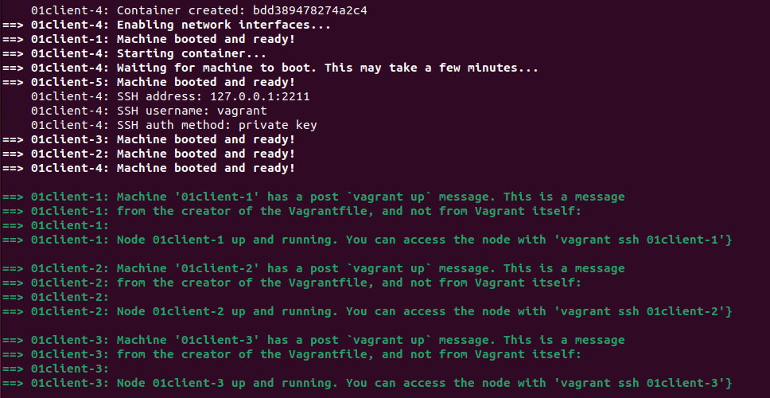
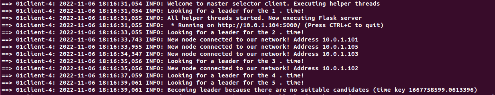
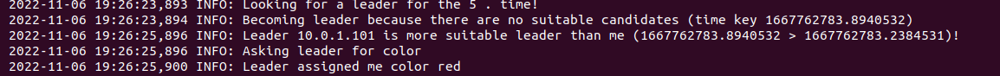
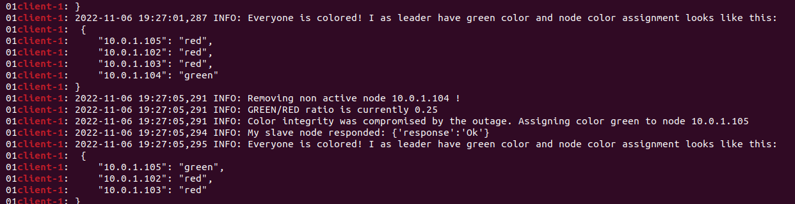
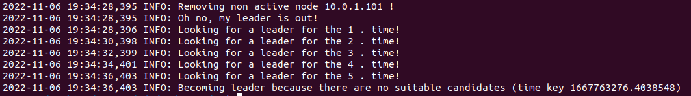

## 1. a 2. SAMOSTATNÁ PRÁCE

### Zadání 1:
Implementujte distribuovanou aplikaci pro volbu 1 uzlu jako mastera z N identických uzlů. Ve druhé fázi master uzel
řídí “obarvení“ 1/3 uzlů jako „zelený“ a zbylých 2/3 jako „červený“. Master uzel je vždy obarvený jako „zelený“,
počet „zelených“ uzlů se zaokrouhluje směrem nahoru.

### Zadání 2:

Implementujte „failure detector“, který detekuje výpadek jakéhokoli uzlu. Pokud vypadne „master“, je
zahájena volba nového. Pokud vypadne „zelený“, nebo „červený“ uzel a poruší se tím tedy poměr (1:2)
„zelených“ a „červených“ uzlů, zahájí master vhodné přebarvení tak, aby opět vyhovovalo danému poměru.

### Technické podmínky:
- Využití nástrojů Vagrant a Docker pro vytvoření a spuštění infrastruktury.
- Sestavení aplikace musí být možné v prostředí Unix/Linux

# Popis implementace

Během celého chodu aplikace je periodicky zasílán broadcast ping, který značí, že je node v síti aktivní (ve třídě master_selector.py konstanta PING_PERIOD). V jiném prostředí by takovýto způsob nemusel stačit (zejména pro systém přes několik privátních sítí), ale pro naše účely se mi tento způsob jevil jako dostatečný. Každý node si tedy díky těmto pingum udržuje list se všemi aktivními nody (dochází ke kontrole podle posledního přijatého pingu). Pokud se uzel neozve během pevně stanoveného času, dojde k jeho vyřazení (ve třídě master_selector.py konstanta MAX_OUTAGE_TIME). 

Každý uzel vypisuje do logu (standardní výstup) zřetelně každou změnu svého stavu pod logovací třídou INFO. V případě, že chcete podrobnější popis je potřeba v souboru main.py na 14. řádce přepsat level na DEBUG. 

1. Volba mastera

   - Pokud v siti neni zadny master (nepřišel žádný ping od žádného po nejakou dobu) zvolíme se po několika pokusech jako master.
   - V případě, že se poté objeví v síti dva uzly, ktere se nazyvaji masterem, tak se předá po provedení porovnání veleni tomu uzlu, ktery ma nižši klíč (čas vytvoření) (endpoint **/fight/**). 
   - O změně svého vůdce se jednotlivé uzly dozví pomocí standardního pingu (obsahuje totiž v něm i ty nejdůležitější informace o jednotlivých uzlech).
   - (**Zadání č.2**) - V případě, že dojde k výpadku master uzlu (dlouho od něj nepřišel broadcast ping), přejde se po čase (MAX_OUTAGE_TIME) k novému volení uzlu, tak jak je popsáno dříve v této sekci.

2. Obarvení uzlů

   - Master uzel je vždy obarvený jako „zelený“, počet „zelených“ uzlů se zaokrouhluje směrem nahoru.
   - Po stanoveni mastera se jednotlivé uzly dotazují přes HTTP API (endpoint **/askForColor/**) pro přiřazení barvy.
   - Master si interně vede mapu všech již přiřazených barev a podle poměru zelených a červených stanoví tázajícímu novou barvu.
   - (**Zadání č.2**) - V případě, že dojde k výpadku obarveného uzlu, podívá se master na aktuální stav poměru barev a podle situace zvolí nejbližší červený/zelený uzel a přebarví ho na druhou barvu (endpoint **/assignColor/**).

## Sestavení a spuštění

Pro sestavení aplikace je potřeba mít na daném přístroji nainstaloné nástroje **Docker** a **Vagrant**. 
Aplikaci je pak možné sestavit pouze zadáním příkazu ``vagrant up`` do terminálu. 
V souboru **VagrantFile** na řádce 29 je možné v proměnné **CLIENTS_COUNT** nastavit počet virtuálních klientů

Pro simulaci výpadku může být využitu příkazu ``vagrant halt <node-name>``.

Po vyzkoušení této aplikace je pak možné spustit příkaz ``vagrant destroy -f`` pro vymazání vytvořené infrastruktury.

## Testování aplikace
Po zadání příkazu zmíněného v předešlé sekci by se do konzole mělo vypsat:

Poté by měla již aplikace běžet a k logům jednotlivých kontejnerů je možné přistoupit pomocí ``vagrant docker-logs ``. 
V případě, že máte zájem o kontinuální výpis, je potřeba přidat ještě parametr ``--follow``.

Výpisy jsou však ze všech kontejnerů zároveň a tak je možné pro filtraci využít standardních nástrojů Linuxu jako je například **grep**
(např. ``vagrant docker-logs | grep client-1``)

Příklad volení vedoucího uzlu: 

Příklad podstoupení silnějšímu vůdci a požádání o barvu:

Pro ověření výpadku uzlu jsem využil příkazu ``vagrant halt 01client-4``. 

Aktuální vedoucí se při výpadku jednoho z jeho obarvených uzlů zachoval následovně:

Při výpadku vůdce se uzel pokusí najít nového vůdce a pokud ho nenalezne, stane se jím sám. 
Výpis pak může vypadat následovně:

